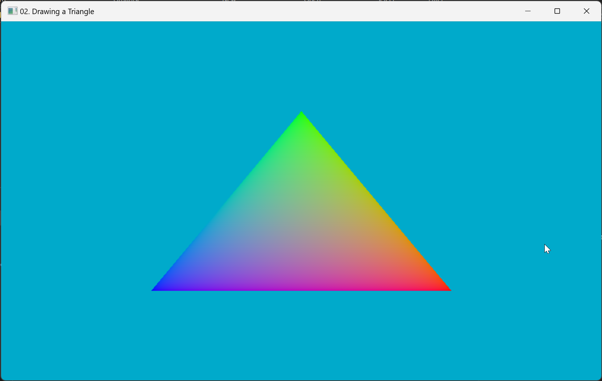
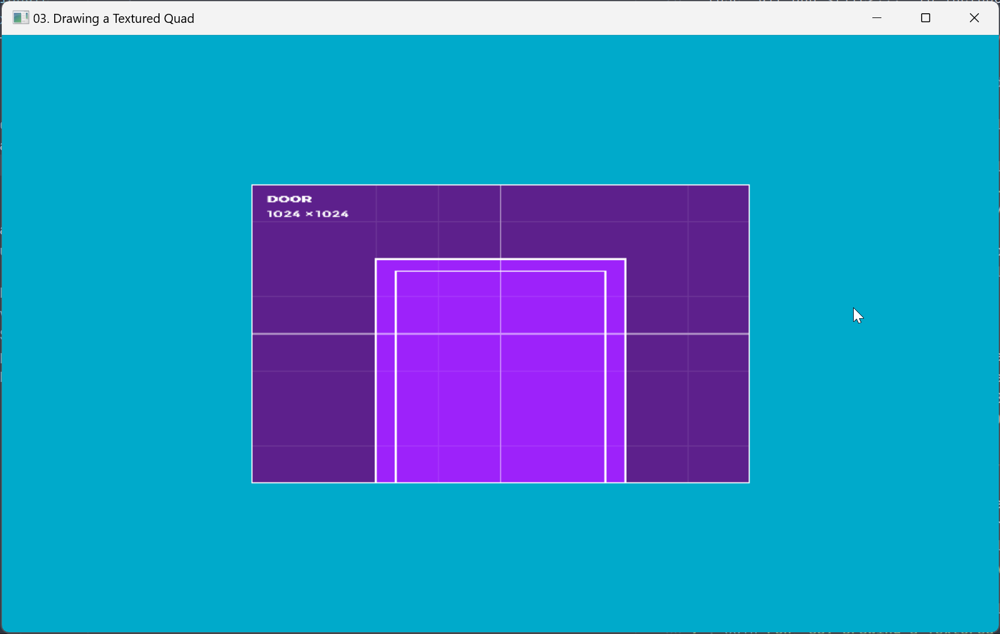
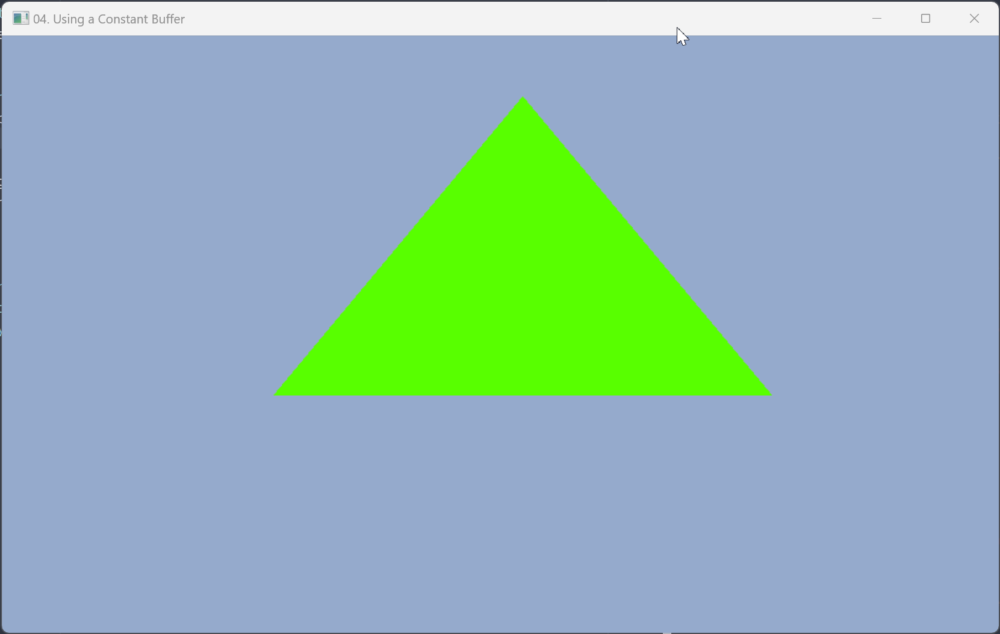
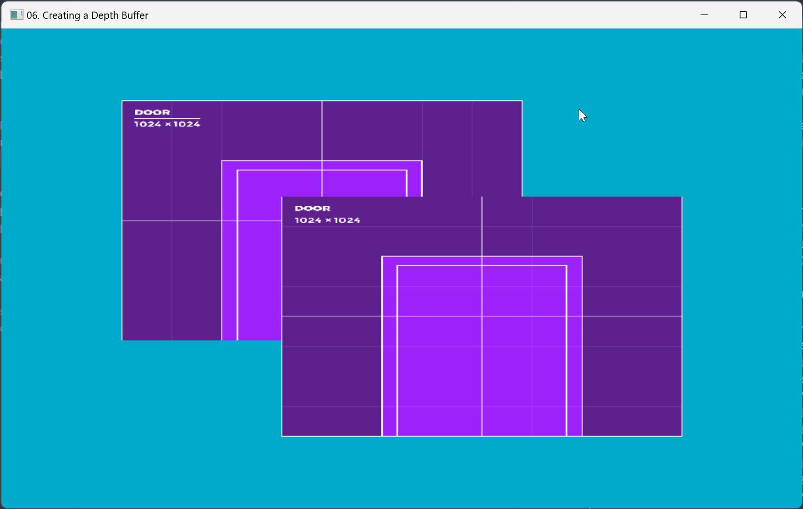
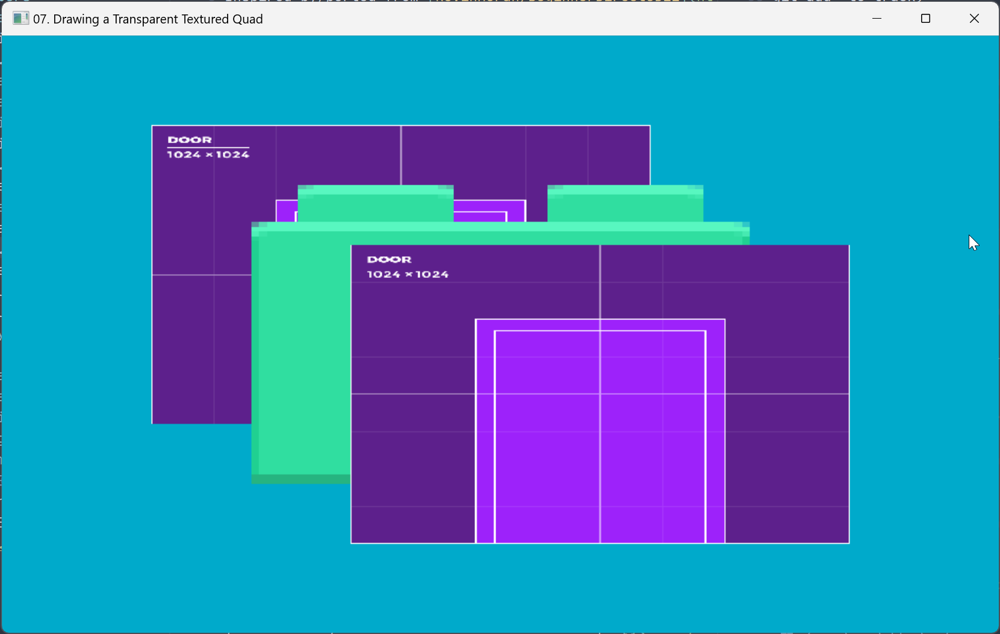
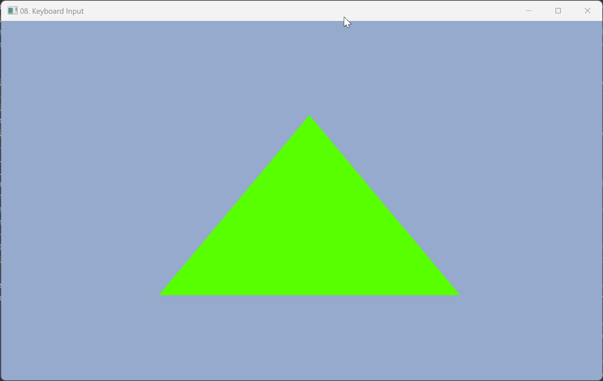
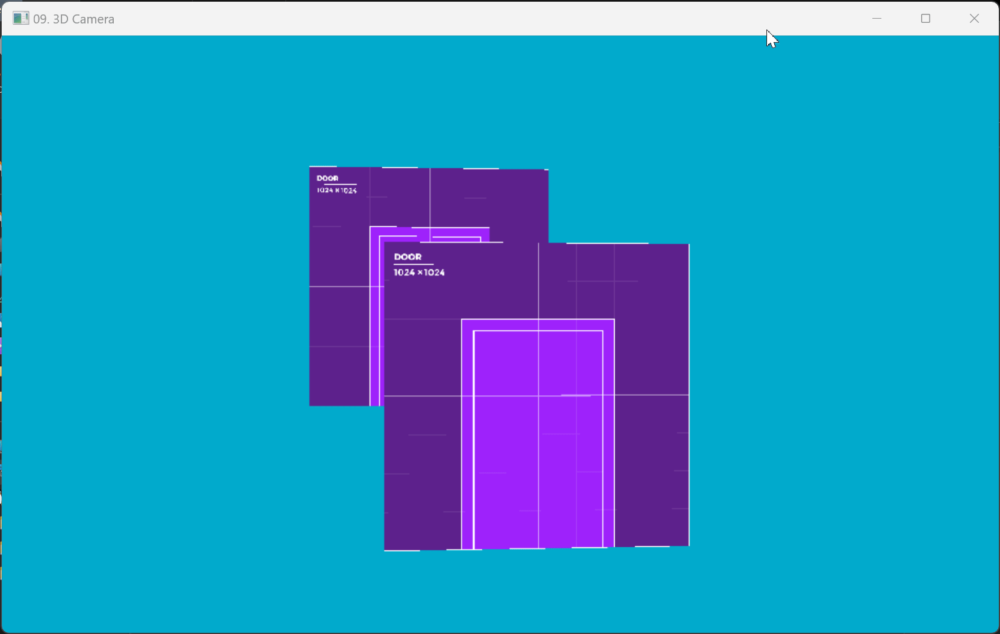
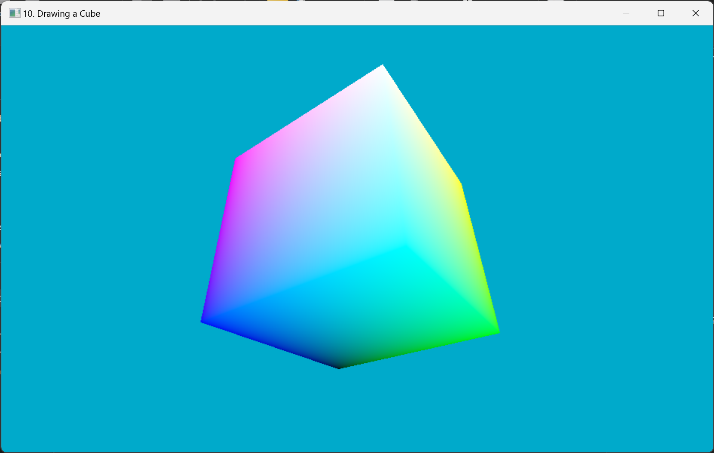
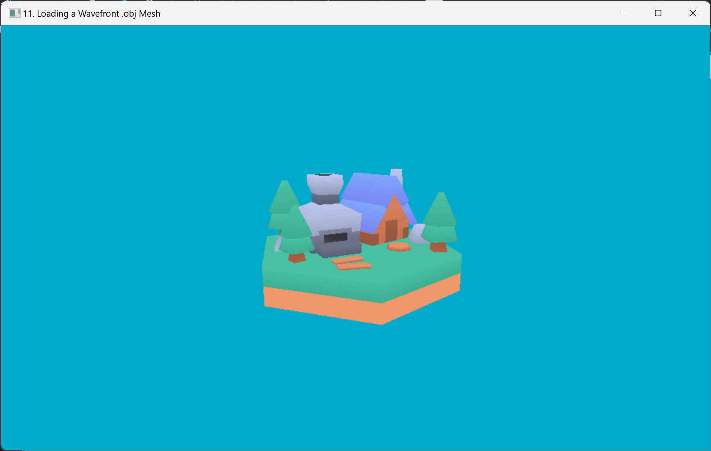
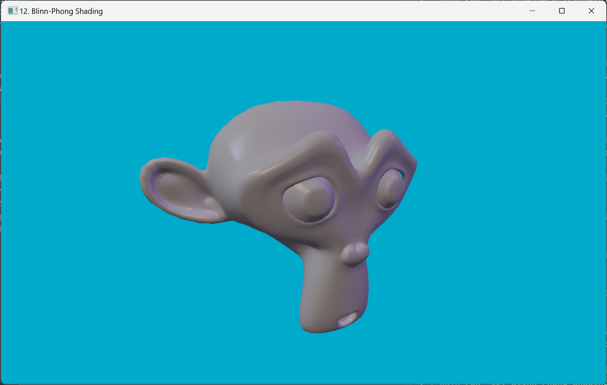

# Beginner Direct3D11 Programming in Odin

Inspired by/ported from [KevinMoran/BeginnerDirect3D11](https://github.com/kevinmoran/BeginnerDirect3D11)


## Running example programs

Make sure Odin is up to date (minimum 2024/11/11).

Each example package can be run using `odin run .` in their respective directories.

```sh
cd "02. Drawing a Triangle"
odin run .
```
---

Images and models by Kenney licensed under Creative Commons Zero (CC0)
- [Prototype Textures](https://kenney.nl/assets/prototype-textures)
- [Brick Pack 2.0](https://kenney.nl/assets/brick-pack)

## Screenshots
| Example                                   | Screenshot        |
| ---                                       | ---               |
| 00. Opening a Win32 Window                |                   |
| 01. Initializing Direct3D                 |                   |
| 02. Drawing a Triangle                    |  |
| 03. Drawing a Textured Quad               |  |
| 04. Using a Constant Buffer               |  |
| 05. Using a High Precision Timer          |                   |
| 06. Creating a Depth Buffer               |  |
| 07. Drawing a Transparent Textured Quad   |  |
| 08. Keyboard Input                        |  |
| 09. 3D Camera                             |  |
| 10. Drawing a Cube                        |  |
| 11. Loading Wavefront .obj                |  |
| 12. Blinn-Phong Shading                   |  |

